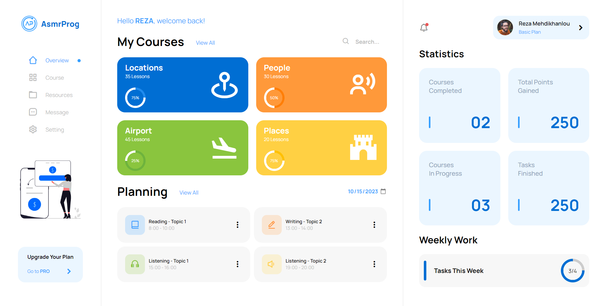
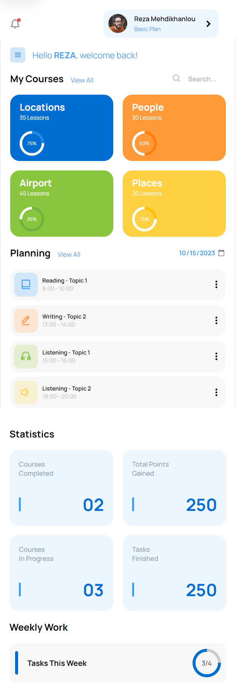

# Responsive Dashboard Design #01
This is a modern HTML, CSS, and JavaScript to create a completely responsive dashboard with mobile menu functionality. We'll be using CSS Grid, CSS Flexbox, Media queries for my responsive design, and CSS  transitions for some cool animation effects. This dashboard design is responsive in all devices!

# Screenshot
Here we have project screenshot :

### Mobile Screenshot

